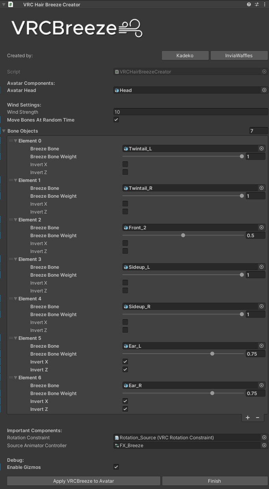

[VRCBreeze](../README.md) | **Instructions** | [Guidelines](../Documentation/GUIDELINES.md)

# Instructions:

**Requires:** [Modular Avatar](https://modular-avatar.nadena.dev/)

> [!NOTE]
> - Modular Avatar is used in merging FX Layers, Expression Menu & Expression Parameters.
> - If you are advanced creator and know how to merge everything, you do not need this then.

## **Steps:**
1) Drag `VRCBreeze.prefab` inside your Avatar.

> [!IMPORTANT]
> - **Do not unpack it.**

3) Assign `Head` bone.

4) Assign any bone you would like to move around by wind in `Bone Objects`.

> [!IMPORTANT]
> - Do not assign child bones!
> - Physbones, that are outside of the bones, will need to have `IsAnimated` enabled manually!

5) Adjust every individual `Weight` to your liking. You can also invert `X` and `Z` directions!

> [!IMPORTANT]
> - Do not leave `Bone Weights` to `0`! Otherwise this bone will be ignored during animation generation.

6) Adjust `Wind Strength`. I recommend enabling `Gizmos` to see how much it will bend. `Weight` is also affecting `Wind Strength`\
`Wind Strength * Weight`.

7) Once you have setup all your bones, click `Apply VRCBreeze to Avatar`.\
   Generated animations can be found at `Assets/VRCBreeze/Animations/Generated/` folder.

8) Click `Finish` or delete `VRC Hair Breeze Creator` component before uploading the Avatar.

> [!TIP]
> - You can always return back to editing by `Right Clicking` the `Component` -> `Removed Components` -> `Revert`.
>
> - Generated Animations can be edited! It's always better to do it yourself! Sometimes the bones may rotate in a different way due to bone rotations, so you may have to fix that manually.
>
> - Bones that are going upwards (For example: Animal Ears) should use Inverted `X` and `Z` axis option!

# **Problems & Solutions:**

**Problem 1:** My hair doesn't move!

**Solution:** Make sure the Physbones have `IsAnimated` set to `true`.\
You may have to increase `Wind Strength` in Unity. Make sure all `Bone Weights` are `above 0`.\
Check, if these bones still exist in the generated animations. If the objects are missing, you may have to rename Hierarchy manually, or create hair movement by yourself.

**Problem 2:** Script has errors!

**Solution:** Check console for details. Make sure your SDK version is up to date and have Modular Avatar imported.
