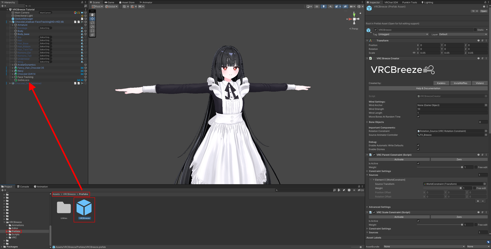
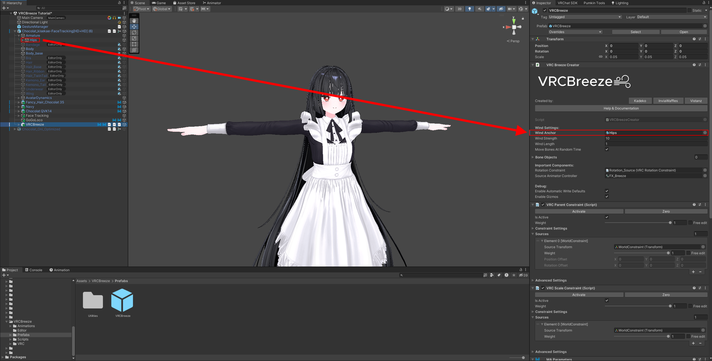
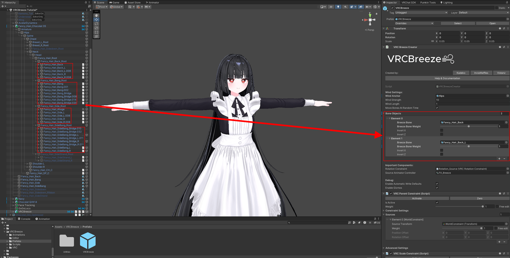
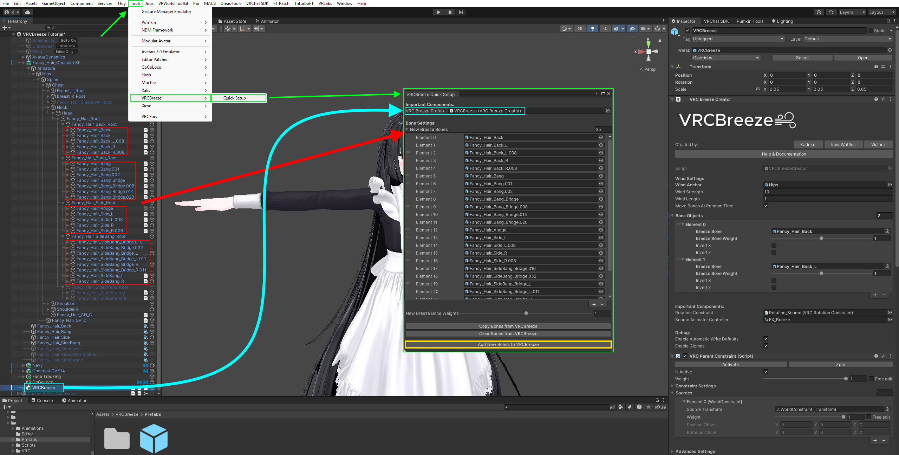
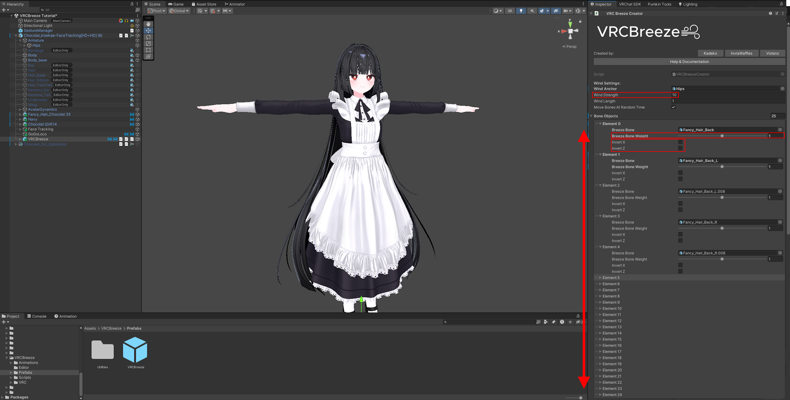

[VRCBreeze](https://github.com/Kadeko/VRCBreeze) | **Avatar Instructions** | [World Instructions](../Documentation/INSTRUCTIONS_WORLD.md) | [General Tips](../Documentation/GENERALTIPS.md) | [Guidelines](../Documentation/GUIDELINES.md) | [Download it here](https://github.com/Kadeko/VRCBreeze/releases/)

# Avatar Instructions

**Requires:** [Modular Avatar](https://modular-avatar.nadena.dev/)\
Modular Avatar is used in merging Expression Menu & Expression Parameters.

## **Steps:**
1) Drag `VRCBreeze.prefab` into your Avatar.

> [!IMPORTANT]
> - **Do not unpack it. Unpacking prefab will cause problems in future updates. Only do this, if you know what you are doing!**

3) Assign `Wind Anchor`. That can be your Hips, Spine, Head or anything in your Avatar's Armature! Wind Anchor will be used in rotating Wind Direction.

4) Assign any bone you would like to move around by wind in `Bone Objects`.
> [!IMPORTANT]
> - Do not assign every child bone that is under the same root bone! You can still use any child bone in the root, as long as you are only using one.

> [!TIP]
> - As you can see, I have way too many bones to setup and I am not going to do all of them individually. Thats why with 1.3.2+ version, you can use Quick Setup tool that allows you to drag multiple bones at once! You can find this tool at: "Tools/VRCBreeze/Quick Setup."
> - Drag `VRCBreeze.prefab` from your Avatar into `VRC Breeze Prefab`.
> - Once you have dragged all the bones in, click `Add New Bones to VRCBreeze` and then you may close Quick Setup window.

5) Adjust `Wind Strength` & `Breeze Bone Weight`, if necessary. I recommend enabling `Gizmos` to see how much it will bend. `Breeze Bone Weight` multiplies with the `Wind Strength`.\
`Wind Strength x Breeze Bone Weight`

> [!IMPORTANT]
> - Do not leave `Breeze Bone Weights` at `0`! Otherwise this bone will be ignored during animation generation.

> [!TIP]
> - Bones that are going upwards (For example: Animal Ears) should use Inverted `X` and `Z` axis option!

6) Publish your avatar! Enjoy the breeze!

# **Troubleshooting:**

**Problem 1:** My bones do not move when the Wind is enabled!

**Solution:**
You may have to increase `Wind Strength` in Unity. Make sure all `Bone Weights` are `above 0`.\
Some Avatar Tools may conflict with this! Try troubleshooting it by disabling some of the features.

**Problem 2:** Script has errors!

**Solution:** Check console for details. Make sure your SDK version is up to date and have Modular Avatar installed.
