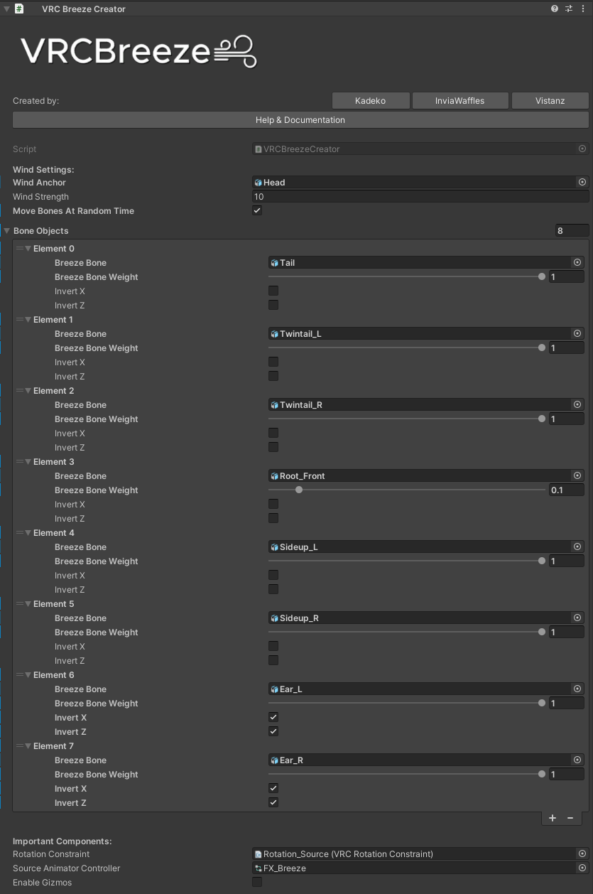

[VRCBreeze](../README.md) | **Instructions** | [General Tips](../Documentation/GENERALTIPS.md) | [Guidelines](../Documentation/GUIDELINES.md) | [Download it here](https://github.com/Kadeko/VRCBreeze/releases/)

# Instructions:

**Requires:** [Modular Avatar](https://modular-avatar.nadena.dev/)

> [!NOTE]
> - Modular Avatar is used in merging Expression Menu & Expression Parameters.

## **Steps:**
1) Drag `VRCBreeze.prefab` inside your Avatar.

> [!IMPORTANT]
> - **Do not unpack it.**

3) Assign `Wind Anchor`. That can be your Hips, Spine, Head or anything in your Avatar's Armature!

4) Assign any bone you would like to move around by wind in `Bone Objects`.

> [!IMPORTANT]
> - Do not assign every child bone that is under the root!!

5) Adjust every individual bone's `Weight` to your liking. You can also invert `X` and `Z` directions!

> [!IMPORTANT]
> - Do not leave `Bone Weights` to `0`! Otherwise this bone will be ignored during animation generation.

6) Adjust `Wind Strength`. I recommend enabling `Gizmos` to see how much it will bend. `Weight` multiplies the `Wind Strength`\
`Wind Strength * Weight`.

7) Publish your avatar! Enjoy the breeze!

> [!TIP]
> - Bones that are going upwards (For example: Animal Ears) should use Inverted `X` and `Z` axis option!

# **Troubleshooting:**

**Problem 1:** My hair doesn't move!

**Solution:**
You may have to increase `Wind Strength` in Unity. Make sure all `Bone Weights` are `above 0`.\
Check, if these bones still exist in the generated animations. If the objects are missing, you may have to rename Hierarchy manually, or create hair movement by yourself.

**Problem 2:** Script has errors!

**Solution:** Check console for details. Make sure your SDK version is up to date and have Modular Avatar imported.
