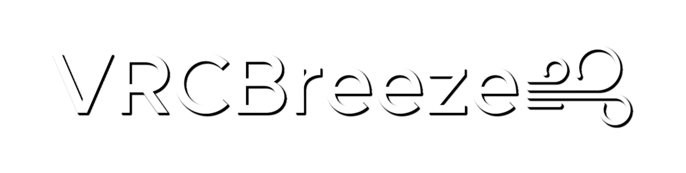

**VRCBreeze** | [Avatar Instructions](Documentation/INSTRUCTIONS.md) | [World Instructions](Documentation/INSTRUCTIONS_WORLD.md) | [General Tips](Documentation/GENERALTIPS.md) | [Guidelines](Documentation/GUIDELINES.md) | [Download it here](https://github.com/Kadeko/VRCBreeze/releases/)

https://github.com/user-attachments/assets/471d30b5-6dd6-4d1b-8b4d-d84232aaf7a5

VRCBreeze is Non-Destructive prefab that allows you to create any bone move in the wind. It can be your hair, clothes, anything! This uses zero colliders and works well with good performant avatars!

## **Features:**
- Wind Speed, Direction, Local Rotation, Indoor Detection, and Strength/Direction Randomization!

- VRCBreeze Prefab uses:
   - 5 Contact Receivers,
   - 1 Contact Sender,
   - 1 Raycast,
   - 4 VRC Constraints,
   - 4 Synced Parameters: 2 float & 2 boolean, in total of 18 Synced Bits.
   - 3 Animator Layers: 1 Layer using Blend Tree.

- This prefab generates 4 animations during Avatar upload, for the wind direction:\
   Forward `(+Z)`, Backward `(-Z)`, Left `(+X)` & Right `(-X)`
   - Directions can be inverted on every individual bone.
   - Animations are rotating the assigned bones to create a wind effect. Perfect with Physbones!

- These 4 generated animations are automatically assigned into a blend tree in `FX_Breeze.controller`.

- Assigned bones, that has Physbones, will automatically change Physbones setting `IsAnimated` to `true`.

- Modular Avatar merges Animator, Expression Menu & Parameters into your Avatar during publishing.

- Most important feature: It is Non-Destructive, meaning it will never overwrite your Avatar in Unity before & after publishing!

## **Known Issues:**

- D4rkpl4y3r's Avatar Optimizer may cause some issues with the moving bones!
   - Try disabling "Optimize FX Layer" option or entire tool, if possible.
